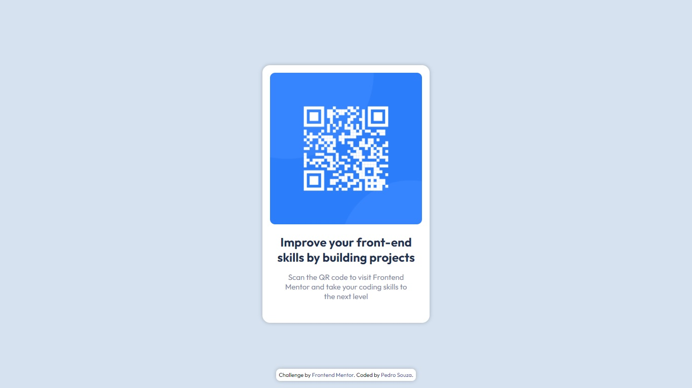

# Frontend Mentor - QR code component solution

This is a solution to the [QR code component challenge on Frontend Mentor](https://www.frontendmentor.io/challenges/qr-code-component-iux_sIO_H). Frontend Mentor challenges help you improve your coding skills by building realistic projects.

## Table of contents

- [Overview](#overview)
  - [Screenshot](#screenshot)
  - [Links](#links)
- [My process](#my-process)
  - [Built with](#built-with)
  - [What I learned](#what-i-learned)
  - [Useful resources](#useful-resources)
- [Author](#author)

## Overview

### Screenshot

### Links

- Solution URL: [Add solution URL here](https://your-solution-url.com)
- Live Site URL: [Add live site URL here](https://your-live-site-url.com)

## My process

### Built with

- Semantic HTML5 markup
- CSS custom properties
- Flexbox
- Mobile-first workflow

### What I learned

It was a good start point project that a could use to practice my HTML and CSS skills.

### Useful resources

- [Responsively](https://responsively.app/) - A really helpful tool when you want to see your project on diferent screen sizes at the same time.

## Author

- Frontend Mentor - [@pedrohsouza](https://www.frontendmentor.io/profile/pedrohsouza)
- GitHub - [@pedrohsouza](https://github.com/pedrohsouza)
